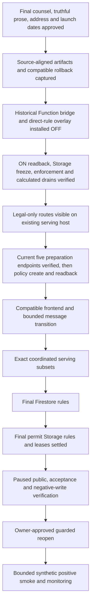

# TAKEME production activation rehearsal — no customer writes

> **6 October 2026 supersession:** [V1 production activation runbook](v1-production-activation-runbook.md) governs the current operator sequence. Historical source/compatibility and component evidence below remain valid within their recorded limits. A perfect bounded deployment/rollback time and X/Y horizon are no longer activation-readiness requirements. No new provider timing/deployment was performed.

Preparation from detached qualification checkpoint `9241867bcf430fc3a5c023d0e8a30892fdd64c19`, 5 October 2026. This document grants no deployment, maintenance, publication, policy/bootstrap, TTL, deletion, payment, schedule, routing or domain changes. Main and approved legal content are unchanged. Netlify remains available. No customer content, Auth enumeration, customer Storage objects or customer logs were inspected.

## A. Live serving baseline and provenance

A fresh read-only control-plane inventory confirms **91 ACTIVE GEN_2 Node22 Functions, all in asia-southeast1**, six source-hash groups, and six existing enabled schedules. The private inventory records every name, revision, runtime, trigger, configured timeout, update time and versioned build/source provenance. HTTP metadata alone does not prove `onCall` authorization or maintenance behavior.

The five new preparation endpoints remain tied to their earlier preparation source; their names do not prove parity with current immutable acceptance-history code. The protected live callables have 60-second configured HTTP timeouts. Auction lifecycle has 120 seconds; its Scheduler attempt deadline is 180 seconds and cadence one minute. Three schedules run each minute (auction lifecycle, engagement, ending alerts); offer expiry, review release and promotion expiry run hourly. They continue during maintenance; no schedule was changed.

Fresh deployed Firestore and Storage rules match the historical capture SHA-256 pins exactly. Read-only masked checks of only `releaseControls/current` and `releasePolicies/current` found both absent. These are nonpersonal system controls, not customer records. Publication source remains false, effective/last-updated dates null, deletion/payment activation unchanged.

Deployment source was read only from generation-pinned `gcf-v2-sources-367115645204-asia-southeast1` archives after confirming that bucket's project number. This is **deployment code**, not the customer bucket. Archive size, version/generation and MD5 were checked, SHA-256 recorded, and each of the 35 protected callable archives' entire file trees compared against its representative. ZIP timestamps can differ: source-hash labels or raw ZIP equality are not accepted alone. All 35 active revisions match their captured code tree. Only source/package files were extracted; no environment files or credentials were displayed or copied into Git.

The task used 82 bounded GETs for resource metadata, deployment source and the two masked controls, without any production mutation or customer-data read. Receipts, source archives, logs, generated packages and emulator artifacts remain privately outside Git.

## B. Minimum historical-handler bridge

The current older protected handlers do **not** read `releaseControls/current`. Writing ON today would not establish a protected-write pause. The current full source is not a substitute: it would add policy/eligibility gates before bootstrap and change old OFF contracts.

`prepare-legacy-maintenance-bridge.mjs` prepares six private review packages from the verified historical source. It refuses unknown revisions/resources, incomplete 35-target coverage, altered archives, unexpected callable/write shapes, support-source conflicts, double wrapping, existing output or Git-contained output. It has no credentials, cloud client or apply/deploy operation. Generated outputs remain explicitly deployment-unapproved.

| Historical source hash | Protected targets | Exact selector members |
| --- | ---: | --- |
| 28d99ce67d121200a0acad4e241bb912b834ee23 | 5 | createAuctionListing, createFixedListingDraft, publishFixedListing, trackMarketplaceEvent, updateFixedListing |
| cd14bbb2d8ae8e5c646637ff23957b3e693df9ef | 24 | cancelPromotionRequest, confirmTransactionCompletion, createPromotionRequest, declineTransactionCancellation, deleteSavedSearch, disputeTransaction, markAllNotificationsRead, markConversationSeen, markNotificationRead, openListingConversation, openNotification, openTransactionConversation, reportPublicReview, requestTransactionCancellation, respondToOffer, saveSearch, sendConversationMessage, setNotificationPreference, setSellerFollow, submitMarketplaceReport, submitOffer, submitTransactionReview, trackPromotionEngagement, updateAdminReport |
| ff1e122fc235ff2b7b95a868a5c55b47ffca842e | 1 | requestUploadPermits |
| ee4342a3283a9fb2b053f4fc7c2654bdcf3cd945 | 1 | updateAuctionListing |
| 086b84f1ba96d2093bad13864a7e1a8e3fdfc80a | 3 | cancelAuction, placeBid, publishAuctionListing |
| c19b2f0115c3f09a634fca5d464e9ede0f885c55 | 1 | removeFixedListing |

The bridge runs **inside the original SDK onCall callback** and preserves its transport/endpoint options, payload validation, authentication, return values, business rules and original error contracts when OFF. An exact managed/Admin project identity is required, with conflicting flags or invalid resources denied. Historical production runtimes need no new policy/environment flags. This context is independent of acceptance, policy publication, deletion and payments.

The central three-field control model is reused. Missing control is intentionally OFF; malformed/read-error/untrusted context pauses. Authenticated protected calls check it before entering the original body. Each scoped SDK transaction reads the control first, so ON invalidates an enable race. AsyncLocalStorage isolates protected invocations; derived/read/scheduler transactions remain unscoped. Three old ignored standalone awaits (draft create, auction create, notification preference merge) become guarded atomic transactions, retaining create-only/merge arguments. Cleanup after an already committed action remains a documented exception.

The earlier policy-aware upload package additionally checks maintenance before its existing policy/lifecycle factory. Its eligibility requirements remain intact when OFF. No current idempotency/policy/retention model is backported into the old messaging body; keyless sends keep their historical semantics. A separate minimal, regional `getProtectedWriteStatus` returns only a boolean.

All six packages compile. All 35 original callable endpoint definitions compare equal to their bridged versions; all 35 reject synthetic authenticated ON requests before validation. Emulator RPC checks preserve actual old OFF draft/Chat/keyless-message/Offer/Follow behavior without a policy record. This is **local compatibility qualification**, not live installation, traffic/IAM/environment preservation or operational deployment timing proof.

## C. Historical direct writes

| Path | Current historical enforcement | Required during pause / final treatment |
| --- | --- | --- |
| Saved create/delete | Owner can write directly; no policy/control guard | Historical Firestore overlay, then final eligibility/control rules |
| Ordinary profile update/admin delete | Direct owner/admin rules; no control | Same overlay, including complete admin OR expressions |
| Meet-up CRUD/private address create/update/delete | Direct scoped rules; no control | Same overlay, then final rules |
| Admin listing/category/promotion-package writes | Direct privileged rules; no control | Same overlay; no admin bypass during pause |
| Valid first profile creation | Narrow existing bootstrap exception | Preserve for sign-in/onboarding; ordinary profile edits pause |
| Conversations/messages/offers/bids/reports and server-owned records | Direct writes already denied | Verified corresponding callable bridges; Admin SDK bypasses client rules |
| Legacy avatar/listing create or overwrite | Historical Storage accepts owner-scoped writes without permits | Static create/update freeze; then final create-only permit rules |
| Owner Storage deletion/cleanup | Owner-scoped allowed | Preserve; this is not a promise that every database/object write stops |
| Acceptance/setup/discovery/derived jobs | Special/read-derived exceptions | Preserve intentional behavior; browse API roles do not imply zero database side effects |

The historical Firestore bridge transforms exactly 12 permissive write clauses, preserves 95 original clause classifications/read/deny semantics and the one validated first-profile-create exception, and guards whole admin OR branches. Client control reads/writes are denied. The captured Storage freeze transforms exactly two create/update clauses to false and preserves reads/owner deletes. Fresh rule parity and nine local historical-rule groups pass. A new real in-flight bridged request was held after its OFF preflight; switching ON before its transaction caused rejection with no committed document. Reopening did not replay it; only an explicit fresh invocation created the synthetic document. No final legal acceptance is added to the historical overlay.

## D–E. Freeze and drains

Install/qualify historical callable and Firestore bridges while OFF **before** attempting authoritative ON. Within the separately approved window, arm ON, apply the separately reviewed static historical Storage freeze, confirm all enforcement points, then drain. The effective pause starts only after these checks; the control's write timestamp is not proof of coverage.

Keep the static freeze until final permit rules are ready and lease/request drains verified. OFF alone does not remove it. Never restore permitless historical rules merely to make uploads work. Reads of existing images and owner cleanup remain available; no broad public write or deletion of images is part of the freeze.

New `requestUploadPermits` calls stop at the guarded callable/transaction. Previously issued final-rule leases may authorize fresh uploads until their exact 120-second expiry; there is no instant global revocation. The final Storage rule spends its two cross-service document accesses on onboarding/permits and the listing, so adding a third global-control lookup is not a valid fix. Use the **last completed permit issuance**, not merely ON write time, as the lease-drain origin. Wait at least 120 seconds, verify denied new issuance and zero still-active **owned synthetic** leases in rehearsal. Do not enumerate customer onboarding/permits under this task. TTL deletion is unnecessary for expiry to deny; expired records can remain physically present.

Derived planning reserves from confirmed metadata and [Firestore transaction limits](https://firebase.google.com/docs/firestore/manage-data/transactions): 60 seconds historical callable admission plus 270 seconds maximum transaction lifetime = **330 seconds after last confirmed old admission**, alongside 120 seconds after last permit issuance. These are conservative planning components, not a cancellation guarantee or a measured full shutdown bound. Server HTTP timeout does not prove no late write; [Functions best practices](https://docs.cloud.google.com/run/docs/tips/functions-best-practices) warn against background work and timeout assumptions. Verified bridged transactions conflict with ON; a retired unguarded revision does not become guarded retroactively.

[Firestore rule deployment documentation](https://firebase.google.com/docs/firestore/security/get-started) gives up to one minute for new requests/listeners and ten minutes for active listeners. Reserve ten minutes after historical rule bridge installation and verify actual direct-write enforcement; do not treat a deploy-success message as propagation proof. Rules-control evaluation and callable checks remain authoritative after installation. Storage rules also need real enforcement/readback verification; no documented universal Storage propagation/cancel timeout is assumed.

The installed Firebase Storage SDK permits upload request retries for up to ten minutes by default (operation retry two minutes). Retries sent after freeze should be denied; this is not a ten-minute completion bound. TAKEME's reviewed browser source uses `uploadBytes`, not a resumable uploader. Separately initiated legacy/resumable or already admitted uploads remain an operational uncertainty: neither permit expiry nor a rules change is asserted to cancel an existing transfer/session. [Cloud Storage resumable-upload documentation](https://docs.cloud.google.com/storage/docs/resumable-uploads) explains session URIs. A provider-level synthetic transfer/freezing rehearsal and nonpersonal completion/denial telemetry are still required. Do not inspect customer objects or fabricate a no-active-upload claim.

`assessActivationDrain` is pure rehearsal validation, not an apply command. It requires all three timestamps, elapsed reserves, old revisions retired, runtime quiescence, historical transfers settled, new permits stopped, freeze and direct enforcement verified. A timer alone never makes it ready. Unknown/future/invalid evidence refuses. Monitoring must establish retirement/settlement without customer payloads. If such evidence cannot be obtained, do not progress or announce an authoritative pause.

## F–H. Auction, deployment and rollback budgets — initial baseline

The following unmeasured observations describe the initial local rehearsal. The later authorized isolated provider measurements, timing reserves, limits, operator table and current decision are in [Operational timing and rollback rehearsal](operational-timing-rehearsal.md). They supersede these unknown component timing rows, but do not authorize production activation or remove the legal/auction/recovery gates.

Auctions retain original clocks; the one-minute lifecycle job continues, using the existing highest valid bidder at the original end. No automatic extensions, resets, late bids or schedule changes. The actual captured historical scheduler was exercised locally under ON and keeps the same end time, winner and final bid. Real start/end boundaries were **not read** because this task forbids customer auction data. Public platform cadence is not a safe auction-window inventory.

The previous measured exclusion-horizon proposal is superseded. Require verified auction creation/publication freeze, retired/drained unguarded admissions, fresh zero active AND published scheduled counts and healthy lifecycle evidence. No clock changes or automatic cancellations. Existing timing helpers remain historical analysis only; unknown complete durations are not a V1 activation gate.

| Operation | Actual observation / dry run | Best / expected / conservative operational window |
| --- | --- | --- |
| Six historical package compiles | 0.88–1.01 seconds each; about 5.44 seconds serial | Local compile observations only; full 35-callable bridge deploy **unknown / unknown / unknown** |
| Demo Next build/provenance | 9.607 seconds, optimized build and scan passed | Local Next build only; production OpenNext/Cloudflare build/deploy **unknown / unknown / unknown** |
| Three historical Cloud Build portions | 25.918, 32.975, 37.086 seconds | Build portions only; full coordinated batch **unknown / unknown / unknown** |
| Firestore/Storage review generation and emulator compile | Local candidates compile/test successfully | Provider deploy/propagation/rollback **unknown / unknown / unknown**; reserve and actual enforcement checks above |
| Bootstrap operator | Pure/mock create/CAS/readback tests pass; actual source correctly blocks apply | Live bootstrap/readback **unknown / unknown / unknown** |
| Safe nine-call metadata refresh | 7.771 seconds end-to-end | One observed metadata sample; future full verification budget **unknown** |

No authorized equivalent staging deployment/rollback was performed in this task; do not extrapolate samples into a claimed production upper bound. Prebuild dependencies/artifacts outside the window. A later approved staging rehearsal must measure all six deployment groups, final batch, legal-only/frontend rollout, rules propagation, bootstrap/readback, cold starts, verification and each rollback route; record actual source/platform versions and repeated samples.

| Rollback action | Classification | What it does not undo |
| --- | --- | --- |
| Frontend/Worker version restore | Delayed until rollout verified; duration unmeasured | Firebase rule/Function/policy state and accepted evidence |
| Function source/revision restore | Delayed rebuild/rollout unless separately qualified revision route; unmeasured | Writes already committed, events and schema/adoption changes |
| Rules restore | Delayed propagation; unmeasured | Existing committed writes/uploads; insecure historical write rules are not a safe final rollback |
| Policy revocation | Fixed control-document transaction can be short, but unmeasured; effects partly delayed | Immutable consent evidence; already issued 120-second Storage permits; owner cleanup |
| Maintenance disable | Transactional CAS/readback; duration unmeasured; separately approved only | Static freeze, mismatched final components or historic insecure contracts |
| Legal publication/acceptance | Partly irreversible | A visible notice or recorded consent cannot truthfully be made never-published/never-accepted |

No rollback is labelled instantaneous. Unknown readback after any control/bootstrap write requires inspect-and-reconcile, never blind retry/repair/delete.

## I. Legal/policy dependency graph



All successful current protected writes and acceptance/first-profile/welcome preparation require the trusted active record and valid current evidence. Read-only/setup availability is intentionally different: setup can report unavailable and public browsing remains possible with no acceptance. Final Firestore eligibility reads the active mirror and must follow bootstrap. Storage uses generated exact policy versions/owner projection, not a third mirror read; operationally it depends on acceptance/permit issuance/bootstrap.

Current production legal routes remain unpublished/noindex; draft content/flags are unchanged. A future **legal-only deployment to the currently serving Netlify site** (or another separately approved route-specific serving bridge) must expose final reviewed `/terms`, `/privacy`, `/privacy/bm`, `/help/prohibited-items` before genuine acceptance is solicited. Do not deploy the whole policy-enforcing frontend merely to publish pages unless it is separately qualified to preserve paused browsing. The existing `canPublishProductionLegal` gate requires both approved legal readiness and `productionReleasePolicy.publicationApproved=true` in the compiled production proof. Therefore that future legal-only artifact needs those separately approved source decisions; a true legal flag alone is insufficient. This source/build publication intent is distinct from runtime activation: keep `releasePolicies/current` absent until final routes are reachable and current prep endpoints are verified. All such source flags remain false in this rehearsal. This task did not create/deploy such a production artifact or change Netlify.

Moving legal routes/website onto Cloudflare would require a separately approved host/routing step; it cannot happen implicitly during bootstrap. Current Cloudflare/Netlify settings are untouched. A legal-only publication artifact, actual final prose/date/address decisions and existing-host deployment/rollback timing remain blockers.

## J–L. Public and client rehearsal

Fresh emulator checks prove public listing detail, seller projection, historical direct listing/profile reads, private message history and image metadata/read access continue under ON. Current candidate tests cover signed-out/signed-in public listing pages and preserved existing offers/Saved/Follow, eligibility precedence, 120-second permits and original auction lifecycle. Historical direct writes and unleased upload/overwrite behavior were tested against actual captured rule bytes, not invented representative rules.

The approved checkpoint's unchanged frontend already has a dismissible notice, retained forms/context, no deferred action or mutation replay, manual retry, background mark-seen refusal handling and unchanged auth/navigation. Fresh app UI tests pass. Its prior actual four-size fixture QA (390×844, 430×932, 768×1024, 1440×900) is reused explicitly because frontend bytes are unchanged; this task does not claim a fresh remote production browser check. The fresh demo optimized build renders legal/help/auth/public routes. It is not a production-publication artifact. Public legal routes in production remain independently blocked until final publication; maintenance does not make draft legal content public.

Actual legacy clients: old keyless message/Offer/Chat/Follow/draft OFF success; all 35 authenticated ON refusals with absent/active policy; malformed state denial; existing history readable; no replay; explicit retry succeeds. Saved/profile/address/admin paths reject under historical overlay. Static freeze rejects new/overwrite uploads and permits cleanup. Original scheduler clocks survive ON. Current candidate: all 35 ON refusals, direct rules, public reads, policy precedence, no replay, owner leases/expiry, acceptance/setup exceptions and original clocks pass. Emulator credentials are random/in-memory. No real customer writes were used.

## M. Current operator sequence — NOT EXECUTED

Use the authoritative [36-step V1 runbook](v1-production-activation-runbook.md), including the OFF-install prerequisite, auction admission guard, zero active/published scheduled checks, 900-second effective-pause/settlement gate, paused negative checks, verified reopen and separately guarded auction restoration. The sequence below was replaced, not supplemented by a competing timing/horizon gate.

Preparation commands (local output only):

```sh
PATH="/opt/homebrew/opt/node@22/bin:$PATH" node --experimental-strip-types --disable-warning=MODULE_TYPELESS_PACKAGE_JSON scripts/prepare-legacy-maintenance-bridge.mjs --input <absolute-private-verified-baseline-directory> --output <new-absolute-private-directory>
PATH="/opt/homebrew/opt/node@22/bin:$PATH" node --experimental-strip-types --disable-warning=MODULE_TYPELESS_PACKAGE_JSON scripts/prepare-maintenance-rule-bridge.mjs --firestore-input <fresh-reviewed-capture> --storage-input <fresh-reviewed-capture> --output <new-absolute-private-directory>
PATH="/opt/homebrew/opt/node@22/bin:$PATH" node --experimental-strip-types --disable-warning=MODULE_TYPELESS_PACKAGE_JSON scripts/prepare-policy-activation.mjs --output <new-absolute-private-directory>
```

Future separately approved deployment template: `firebase deploy --project takeme-52b80 --config <reviewed-private-config-for-exact-group> --only functions:<member>,functions:<member>`. Populate from one row of B only; choose `getProtectedWriteStatus` once. Such a deployment config/artifact and live environment/IAM preservation have **not** been produced or authorized here. Future final rule configs must point at actual source-qualified artifacts. Exact operator enable/reopen commands and CAS restrictions are in `protected-write-maintenance.md`; none applied. No override, policy acceptance bypass or remote synthetic smoke is authorized by these examples.

## N. Abort state matrix

| Point | Safe abort before / after | Rollback | Reopen writes |
| --- | --- | --- | --- |
| Before installation/ON | Stop without production changes; OFF remains baseline only after verified installation parity | If partial bridge install changed behavior, restore matching compatible OFF artifact and verify | Do not enable a pause/window yet |
| Bridge/overlay partly installed | Stop new rollout; do not claim authoritative pause | Restore compatible guarded baseline as needed; capture unknown outcomes | Do not arm/reopen using partial coverage |
| ON/freeze established, before legal/bootstrap | Stop, preserve reads and ON/freeze | Compatible baseline restore can be reviewed; static freeze persists | Current disable source refuses; no legacy recovery override exists. Separate reviewed recovery needed |
| Legal published, before bootstrap | Stop, ON/freeze remain; legal exposure is already a publication | Approved existing-host rollback if needed | No, source/policy may still be incomplete |
| Bootstrap created/unknown readback | Inspect fixed policy only under authorization; preserve consent/evidence | Reconcile unknown create; revoke via separately approved fixed-record operation if needed, never bootstrap repair | No while inactive/inconsistent |
| Frontend/Function/rule partial update | Stop, keep ON and secure freeze/permit rules, preserve public reads | Roll forward or restore **compatible** secure components; retain keyed/permit/history schema support | No partial or historical-insecure reopen |
| Fully coherent final state | Stop for owner review; all gates still needed | Optional compatible rollback, verify again | Only separately approved guarded final reopen |
| After reopen regression | Re-establish pause with fresh CAS, preserve reads/evidence | Compatible rollback/forward recovery; committed effects not undone | No until repaired state is verified and owner reapproves |

`classifyActivationAbort` tests prohibit automatic legacy reopen, evidence deletion or pretending bootstrap/publication is fully reversible. The current bootstrap is create-only, not a policy revocation/repair tool. A production revocation or pre-policy legacy recovery operation would require separate reviewed authorization; none is implemented as a shortcut here.

## O. Narrow monitoring

Use existing Cloud Monitoring/Logging, Firebase and Worker/Netlify facilities; no paid vendor or new observability deployment added. Review aggregate counts/latency/status codes only, not request payloads, tokens, cookies, emails, listing/customer IDs, message/bid/offer contents or private addresses.

- Function error/timeout/latency and revision traffic; expected maintenance denials distinguished from 5xx and unexpected accepted protected requests.
- Firestore write-denial counts, read/write rate changes, permission regression and transaction contention on the fixed control; a global zero-write count is not expected because derived/setup work continues.
- Storage create/update attempts and denials, transfer completions/failure rates/read availability; no object listing/content read to infer drained customer transfers.
- Auth/policy-unavailable/acceptance rejection rates; immutable-history verification uses dedicated synthetic nonproduction accounts here.
- Message/offer/bid error categories and duplicate-side-effect regressions after later authorized synthetic smoke; no customer payload inspection.
- Auction job success/latency/overlap, missed cadence and aggregate deadline-boundary risk; never alter clocks/schedules to hide failure.
- Worker/Netlify status/error/latency, legal availability and image/read rendering; source/project/bucket/Functions destination isolation.
- Unexpected protected-write success, inconsistent parity/control, public-read outage, missing monitoring or unsafe auction boundary means **stop and keep/re-establish pause**. Thresholds/latency baselines must be owner-reviewed from an equivalent measured staging rehearsal, not invented numeric alert limits.

## P. Qualification and outstanding gates — initial local-only rehearsal

Fresh app suite: 386 pass. Fresh Functions suite: 160 pass. App/Functions TypeScript and ESLint pass. Six historical packages compile; 35 endpoint comparisons/ON refusals pass. Demo integration groups: eight actual historical callable (including a real preflight-to-transaction enable race), nine historical-rule/freeze, ten current maintenance and two real-clock permit-drain groups. After waiting the actual 120-second lease, its upload was denied and no active owned synthetic lease remained. Frontend demo build passes, 9.607 seconds. No frontend redesign/source changes were made. Private harness composes real captured packages only for testing, normalizes duplicate Admin initialization, and remaps canonical emulator port assertions in private current compiled copies; these are not deployable artifacts or production behavior changes. External transport and ADC access are blocked, with only isolated demo loopback service access allowed.

The type-only maintenance model dependency was separated from legal policy code so historical packages can compile without pulling a second runtime policy implementation. All production/legal approval flags, versions and dates remain unchanged. Generator/runtime/state/drain tests contain no fixed credentials; private capture/source/config/compile/build/emulator/log outputs remain outside Git or ignored.

Outstanding operational gates:

1. Preserve the completed component rehearsal evidence; final source/artifact and live configuration/IAM/traffic compatibility still require verification, not repeated expensive timing cycles.
2. Verified auction admission freeze, fresh zero active/published scheduled aggregates, retired/drained admissions and healthy lifecycle. Whole-window timing/X/Y are no longer required.
3. Final legal counsel/address/prose/launch-date/publication approval and qualified legal-only artifact on the existing serving host.
4. Current immutable-history preparation endpoint and final source/rules/frontend adoption qualification; bounded legacy-message and upload-transition settings approved, not inferred.
5. Actual installation, propagation, retired-revision/runtime/transfer quiescence and monitoring proof. No customer-data reads or provider deployments occurred here.
6. A separately reviewed early-abort recovery procedure if legacy reopening before final policy activation is desired; current fail-closed reopen intentionally refuses it.

**Current reassessment:** local bridge/freeze compatibility and measured components support the owner-approved open-ended runbook. Missing complete durations/horizons no longer block preparation. Actual production activation still requires all legal/artifact/rollback/enforcement/monitoring/zero-auction execution gates and separate approval. Nothing was committed, pushed, deployed, activated, written to production or changed in cloud/DNS/Hostinger/Netlify.
